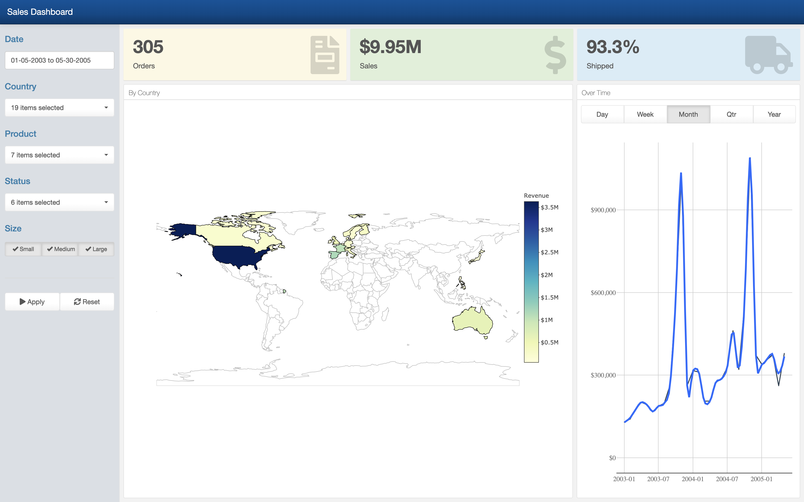

### Sales Dashboard with Forecasting

This is a dashboard created using Shiny and FlexDashboard. It utilizes techniques from Business Science University's [DS4B-102](https://www.business-science.io/university/2019/05/16/course-launch-shiny-web-application-level-1.html) course. Core packages used include the tidyverse suite for data manipulation, ggplot & plotly for visualization and parsnip & XGBoost for ML-based forecasting. 

Dashboard: [Link](https://joon.shinyapps.io/veh_parts_sales_dash)

Data Source: [Kaggle](https://www.kaggle.com/kyanyoga/sample-sales-data "Kaggle")
